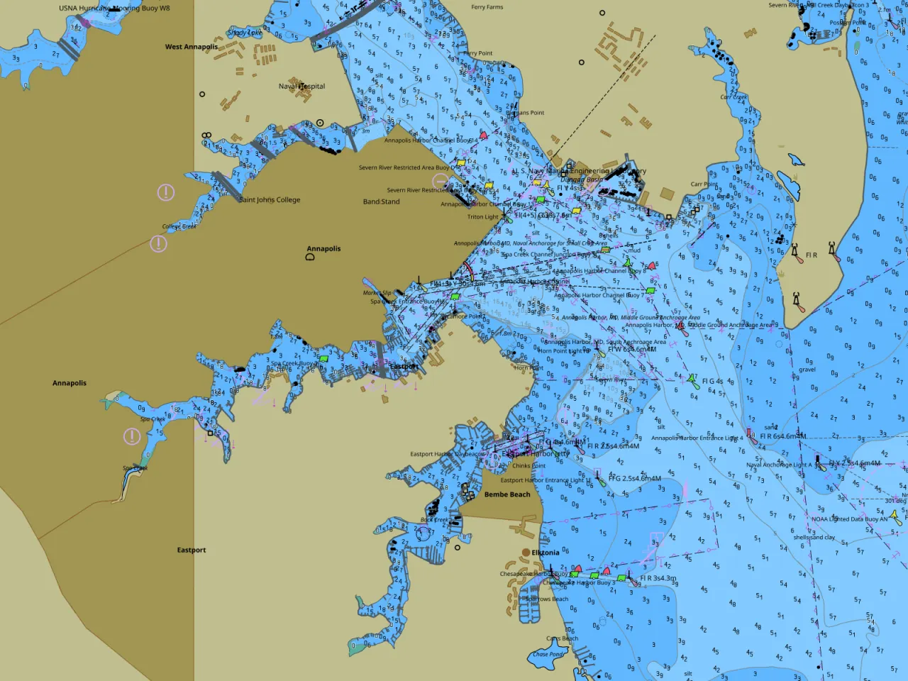

<h1 align="center">tile57</h1>

<p align="center">
  <b>⚓ Official nautical charts, ready to draw.</b><br>
  tile57 reads the electronic charts hydrographic offices publish and draws
  them the way the standard says they should look: in your app, on your
  server, or right in the browser.
</p>

<p align="center">
  <a href="https://beetlebugorg.github.io/tile57/demo"><b>🌊 Live demo</b></a>
  &nbsp;·&nbsp;
  <a href="https://beetlebugorg.github.io/tile57/"><b>📚 Docs</b></a>
  &nbsp;·&nbsp;
  <a href="LICENSE"></a>
</p>

---

## Try it in your browser

<a href="https://beetlebugorg.github.io/tile57/demo">
  
</a>

The **[live demo](https://beetlebugorg.github.io/tile57/demo)** is an
S-57/S-101 chart viewer in one page. Grab a free chart zip from
[NOAA](https://charts.noaa.gov/ENCs/ENCs.shtml), drop it on the map, and the
page does the rest: it bakes the charts, keeps them in your browser, and draws
them with WebGPU. Pan, zoom, and rotate a whole chart library. Nothing is
uploaded and there is no server.

> [!WARNING]
> **Not for navigation.** This is not a certified navigation product. Do not use
> it to navigate. Refer to [Known limitations](docs/docs/limitations.md).

## What you can do with it

- **Build a chartplotter** for desktop, mobile, embedded, or pure web. Point
  tile57 at a folder of charts and it becomes one seamless, queryable map.
- **Quilt a whole library.** Charts at every scale stitch into one chart: the
  most detailed chart wins each stretch of water, the general chart fills
  around it, and a newer edition wins an overlap. Harbor to ocean is one
  continuous map, the way an ECDIS quilts.
- **Serve charts to any map client.** Bake once and serve standard vector
  tiles with a matching style; MapLibre draws them out of the box.
- **Draw at full speed.** tile57 hands your GPU a ready-to-draw scene. Pan,
  zoom, and rotate without rebuilding anything.
- **Put charts on paper.** Finished PNG images and vector PDF pages, straight
  from the source data.
- **See the world under the chart.** Satellite photos (MBTiles) and scanned
  raster charts (BSB/KAP) draw beneath the official one, which opens up so you
  can see through it. Every buoy, light, and depth stays on top.
- **Ask the chart questions.** What is under the cursor, what the chart says
  about it, and the notes and diagrams it carries.

The portrayal is official, not a look-alike: tile57 runs the IHO's own
portrayal rules against the chart's own records. It reads today's charts
(S-57) and tomorrow's (S-101), and it embeds anywhere: one small library
with no runtime dependencies.

## Start here

```sh
brew install beetlebugorg/tap/tile57        # or grab a binary from Releases

tile57 bake ENC_ROOT -o out/                # every chart -> its own archive
tile57 png ENC_ROOT --view -76.48,38.974,15 --size 1600x1200 -o chart.png
```

Binaries for macOS, Linux, and Windows are attached to every
[release](https://github.com/beetlebugorg/tile57/releases). Use the engine
from [C](https://beetlebugorg.github.io/tile57/c-api),
[Zig](https://beetlebugorg.github.io/tile57/zig-api),
[JavaScript](https://beetlebugorg.github.io/tile57/wasm), or
[Go](https://github.com/beetlebugorg/tile57/tree/main/bindings/go), or through
the [CLI](https://beetlebugorg.github.io/tile57/cli). The
[docs](https://beetlebugorg.github.io/tile57/) cover everything else.

## Build from source

```sh
git submodule update --init --recursive   # the vendored S-101 catalogue
zig build && zig build test               # needs Zig 0.16 only
```

## AI-first development

This project is built with AI assistance. Use AI tools freely. The most useful
contribution is a clear set of requirements, or a rough prototype of what you
want, rather than a patch. Refer to the
[contributing guide](docs/docs/contributing.md).

## License

tile57's own code is [MIT](LICENSE) © Jeremy Collins. It embeds the IHO S-101
Portrayal Catalogue (© IHO). It vendors nanosvg (zlib) and stb_image_write
(public domain). NOAA ENC charts are U.S. public domain and **not for
navigation**.
