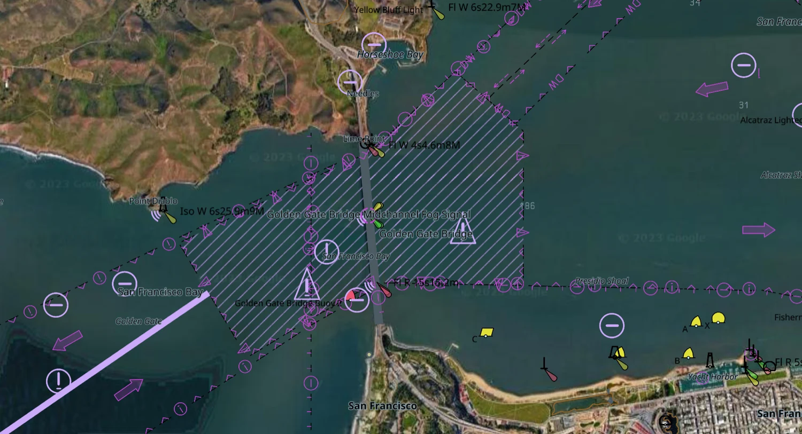

# Raster charts



Above: a Google satellite raster chart with an ENC drawn over it. The ENC has
dropped its depth and land fills where the raster chart covers, and keeps
everything the picture cannot carry — the depth contours, the traffic
separation, the buoys, the lights, the soundings and the labels. See
[Chart over picture](#chart-over-picture).

A raster chart is a chart made of pictures: satellite imagery a mariner
supplies as MBTiles, another vendor's chart rendered to tiles, or an RNC from a
BSB/KAP sheet.

`tile57_raster_chart` is a **peer** of `tile57_chart`, not a kind of one. It
serves tiles and nothing else. It carries no features, so there is no portrayal
to run, no pick to answer and no view to render.

## Read one

```c
tile57_raster_chart *rc;
tile57_error err;
if (tile57_raster_chart_open("EU-SI-Full.ArcGIS.mbtiles", &rc, &err) != TILE57_OK)
    return report(err.message);

tile57_raster_chart_info info;
tile57_raster_chart_get_info(rc, &info);   /* zoom range, encoding, bounds */

uint8_t *png; size_t len;
tile57_raster_chart_tile(rc, 15, 17631, 11711, &png, &len, &err);
if (png) { draw(png, len); tile57_free(png); }   /* NULL is ordinary: see below */

tile57_raster_chart_close(rc);
```

The file opens in place. tile57 imports nothing and copies nothing. SQLite reads
the file read-only with `PRAGMA mmap_size`, so the kernel pages the chart in and
a half-gigabyte file never becomes resident.

## What the reader corrects

SQLite gives the rows. The reader corrects four things that SQLite does not.

**The y axis.** MBTiles rows count from the south (TMS). tile57 and its callers
count from the north (XYZ). The reader inverts the row. Without this every tile
is upside down.

**The file name.** The reader ignores it. Both community charts measured for
this page declare `minzoom 9, maxzoom 17` and are named `Z10-Z18`. Do not use
the name.

**Absent metadata.** If the file gives no zoom range or no bounds, the reader
calculates them from the tile index. `zooms_declared` and `bounds_declared`
report the source of each.

**The tile size.** No field records it. The reader reads it from a picture
header. A 512 px set drawn as 256 px is wrong by a factor of two.

## Absent tiles are ordinary

`tile57_raster_chart_tile` gives NULL with `TILE57_OK` where the chart has no
tile. This is a usual result, not a failure. These tile pyramids follow a
coastline: about one third of the ground inside their own bounds carries a tile
at the deepest zoom. Draw the vector chart alone there.

## Scale, and the quilt

`info.scale` is the compilation scale denominator, or 0.

The scale decides whether a raster chart can quilt. A baked RNC gives a scale
and a border polygon, so it composes through the ownership partition by scale
band and edition date, as a vector chart does. A community MBTiles gives
neither. It reports 0, it owns no ground, and the compositor skips it. This is
the rule the compositor applies to a vector chart with no coverage.

## Chart over picture

The area fills of a vector chart are opaque. They hide a raster chart below
them.

`mariner.chart_over_image` removes the `DEPARE`, `DRGARE`, `UNSARE` and `LNDARE`
fills. These stay: every depth contour with the emphasis of the safety contour,
every point symbol, the lights and their sectors, the soundings, the text, and
every boundary drawn as a line or a pattern.

```sh
tile57 png ENC_ROOT --over-image --view -76.4767,38.9763,15 -o chart.png
```

The mode removes the colour bands that show which water is safe. Only the
safety contour then carries that information. Show the mariner that the mode is
on.

The mode also engages the S-52 §10.3.4.2 DisplayPlane precedence. The clause
applies when an image is below the chart. `radar_overlay` keeps its own meaning.
Both satisfy the same condition.

`tile57_mariner_image_dim` gives the dim factor for the colour scheme. A
daylight photograph at full brightness removes the dark adaptation that the dusk
and night schemes protect.

:::tip A GPU host can do this per pixel instead
`tile57_gpu_scene` gives each range a `depth` in (0,1) from its paint order:
range *i* of *N* gets `(N-i)/(N+1)`, so a later range is nearer. The opaque area
fills paint first and are therefore the farthest ranges in the scene.

A host can draw the raster chart's tiles into the depth buffer at a `depth`
between the last opaque area range and the range after it, with depth write on.
The fills then fail the depth test where a tile covers them, and pass
everywhere else. The vector chart keeps its shading outside the raster chart's
coverage and around every hole in it, with no rebuild and no scene-wide switch.

`mariner.chart_over_image` is for the outputs that have no depth buffer:
`_png`, `_pdf` and `_canvas`.
:::

## Inspect one

```
tile57 raster info <chart.mbtiles>
```

It prints what the chart declares beside what its name claims:

```
  zoom         9..17
  encoding     jpeg
  tile size    256 px
  row origin   tms
  tiles        5114
  bounds       13.359375,45.089036,14.062500,46.073231
  scale        none declared (owns no ground; cannot quilt)

  the NAME claims zoom 10..18. The file says 9..17. Believe the file.
```

## BSB/KAP

`raster.bsb` reads a BSB/KAP sheet: the header, the palette, the run-length
raster and the georeferencing.

Calculate the georeferencing with `fitRefs`, from the `REF` control points of
the sheet. Do not use the published `PWY` polynomial for latitude. On the
1:10,000,000 North Pacific sheet it misses its own control points by 0.069°,
about 7 km, because a low-order fit in pixel space cannot follow Mercator across
56° of latitude.

The fit is **ellipsoidal**. NOAA sheets are NAD83/GRS80, and the spherical form
leaves 37 times the residual.

The fit is **bivariate**: both pixel axes feed both outputs. NOAA publishes
skewed plotting sheets, such as `KNP/SK=31.1461111` on Newport-to-Bermuda. A fit
of x to longitude and y to latitude misses that sheet by 0.9°.

`Header.dtm_lat` and `dtm_lon` give the datum shift in arc seconds. `KNP/GD`
gives the datum. Apply the shift. Older sheets are NAD27, about 40 m from WGS84
on the US east coast, and an unshifted sheet reads as a chart error against a
GPS position.

## Bake a sheet

```
tile57 bake <chart.KAP | BSB_ROOT> -o <out-dir>
```

This writes the same structure the ENC bake writes: one archive per sheet under
`<out>/<STEM>/<STEM>.pmtiles`, and the ownership partition in
`<out>/partition.tpart`. The tiles are PNG instead of MLT, and the metadata
carries the sheet's own coverage, compilation scale and edition date. A baked
sheet opens with `tile57_raster_chart_open` like any other raster chart.

Each sheet contributes three facts a community MBTiles has none of:

| from | fact |
|---|---|
| `PLY` | the border polygon, which stands in for M_COVR |
| `KNP/SC` | the compilation scale, which places the sheet in a band |
| `CED` | the edition date and revision, the tie-break between two sheets of the same scale |

The border cuts the paper collar off. Two sheets of the same area meet at their
neat lines, and neither prints over the other's margin.

The zoom range runs from z0 to the zoom whose ground resolution matches the
sheet's own pixel. A 1:10,000,000 ocean sheet reaches z7; a 1:1,058,400 plotting
sheet reaches z10. Baking deeper would invent detail the survey never had, so a
host that wants a closer look magnifies the top level.

A sheet whose fit cannot reproduce its own control points is refused, and the
bake says which sheet and why. The tolerance is in source pixels, so it means
the same thing on a harbour plan as on an ocean sheet.

## Quilt them

```c
tile57_compose *c;
tile57_compose_rasters(charts, n, &c, &err);

uint8_t *png; size_t len; bool owned;
tile57_compose_tile(c, 12, 654, 1583, &png, &len, &owned, &err);
```

Ownership resolves exactly as it does for vector charts: the same compilation
scale bands, the same date tie-break, the same partition. Sheets that declare no
scale or carry no coverage are skipped, which is the rule
`tile57_compose_open` already applies.

A raster compositor serves `tile57_compose_tile` and returns
`TILE57_ERR_UNSUPPORTED` from `_png`, `_pdf`, `_canvas`, `_surface`, `_labels`,
`_query` and `_gpu_scene`. A chart made of pictures portrays nothing.

**One compositor holds one kind.** Composing raster charts stacks pictures where
composing vector charts clips geometry, and the two paths share the ownership
partition and nothing above it. `tile57_compose_open` reports
`TILE57_ERR_UNSUPPORTED` for a picture archive. A host showing an RNC quilt under
a vector quilt opens two compositors, which is what the mariner wants: two
layers, not one blended chart.
